# Visual Command Editor (비주얼 커맨드 에디터)

장치 제어 명령어를 리스트 형태로 작성하고, 이를 **노드 그래프(Flowchart)** 형태로 실시간 시각화하여 관리하는 Qt 기반 데스크톱 애플리케이션입니다.

## ✨ 주요 기능 (Key Features)

* **✏️ 명령어 셋 편집 (Command Editing)**
    * 리스트 위젯을 통한 직관적인 명령어 추가 및 수정
    * 속성별 타입(S, C, D) 지정을 통한 로직 구분

* **📊 실시간 노드 시각화 (Real-time Visualization)**
    * 텍스트 명령어 리스트의 즉각적인 노드 플로우차트 변환
    * 분기(Check) 및 지연(Delay) 등 로직 흐름의 시각적 확인

* **📡 장치 제어 패킷 전송 (Device Control - Write)**
    * 명령어 셋을 하드웨어 프로토콜 맞춤형 패킷으로 변환
    * 시리얼 통신 등을 이용한 장치(Device)로의 명령 업로드

* **📥 장치 데이터 수신 (Device Sync - Read)**
    * 장치 내 저장된 기존 명령어 셋 다운로드
    * 하드웨어와 소프트웨어 간 데이터 동기화 지원

* **💾 프로젝트 저장 및 불러오기 (File Persistence)**
    * 전용 포맷(`.wcmd`)을 이용한 작업 내역 저장 및 로드
    * 데이터 이식성 확보 및 백업 지원
 

## 🛠 Tech Stack

* **Language**: C++
* **Framework**: Qt (Widgets, Graphics View)
* **Tools**: Qt Creator, qmake

## 🏗 Structure (Class Diagram)

