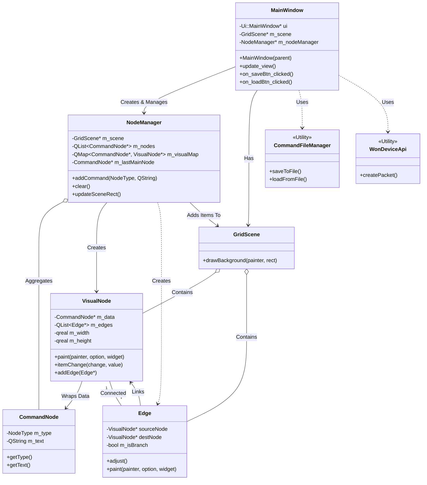

# USB-Macro
USB-Macro

```mermaid
classDiagram
    %% 메인 윈도우: 전체 관리
    class MainWindow {
        -Ui::MainWindow* ui
        -GridScene* m_scene
        -NodeManager* m_nodeManager
        +MainWindow(parent)
        +update_view()
        +on_saveBtn_clicked()
        +on_loadBtn_clicked()
    }

    %% 노드 매니저: 로직과 뷰의 중개자
    class NodeManager {
        -GridScene* m_scene
        -QList~CommandNode*~ m_nodes
        -QMap~CommandNode*, VisualNode*~ m_visualMap
        -CommandNode* m_lastMainNode
        +addCommand(NodeType, QString)
        +clear()
        +updateSceneRect()
    }

    %% 그래픽 씬: 배경 및 아이템 컨테이너
    class GridScene {
        +drawBackground(painter, rect)
    }

    %% 비주얼 노드: 실제 화면에 그려지는 박스
    class VisualNode {
        -CommandNode* m_data
        -QList~Edge*~ m_edges
        -qreal m_width
        -qreal m_height
        +paint(painter, option, widget)
        +itemChange(change, value)
        +addEdge(Edge*)
    }

    %% 커맨드 노드: 순수 데이터 (Type, Text)
    class CommandNode {
        -NodeType m_type
        -QString m_text
        +getType()
        +getText()
    }

    %% 엣지: 노드 간 연결선
    class Edge {
        -VisualNode* sourceNode
        -VisualNode* destNode
        -bool m_isBranch
        +adjust()
        +paint(painter, option, widget)
    }

    %% 유틸리티 클래스
    class CommandFileManager {
        <<Utility>>
        +saveToFile()
        +loadFromFile()
    }

    class WonDeviceApi {
        <<Utility>>
        +createPacket()
    }

    %% 관계 정의 (Relationships)
    MainWindow --> NodeManager : Creates & Manages
    MainWindow --> GridScene : Has
    MainWindow ..> CommandFileManager : Uses
    MainWindow ..> WonDeviceApi : Uses

    NodeManager o-- CommandNode : Aggregates
    NodeManager --> VisualNode : Creates
    NodeManager ..> Edge : Creates
    NodeManager --> GridScene : Adds Items To

    VisualNode --> CommandNode : Wraps Data
    VisualNode "1" -- "*" Edge : Connected

    Edge --> VisualNode : Links
    
    GridScene o-- VisualNode : Contains
    GridScene o-- Edge : Contains
```
