# Visual Command Editor (비주얼 커맨드 에디터)

장치 제어 명령어를 리스트 형태로 작성하고, 이를 **노드 그래프(Flowchart)** 형태로 실시간 시각화하여 관리하는 Qt 기반 데스크톱 애플리케이션입니다.

## ✨ Key Features (주요 기능)
* **명령어 셋 편집**: 명령어 셋을 편집하고 타입(c, s, d)을 지정
* **실시간 노드 시각화**: 리스트에 입력된 명령어를 타입에 맞춰 시각적 노드로 변환
* **장치 전송**: 명령어들을 패킷 구조체로 변환하여 장치에 write
* **장치 일기**: 장치에 저장된 명령어 셋을 다운로드
* **명령어 셋 저장**: 명령어 셋을 pc에 저장하고 불러오는 기능

## 🛠 Tech Stack

* **Language**: C++
* **Framework**: Qt (Widgets, Graphics View)
* **Tools**: Qt Creator, qmake

## 🏗 Structure (Class Diagram)

