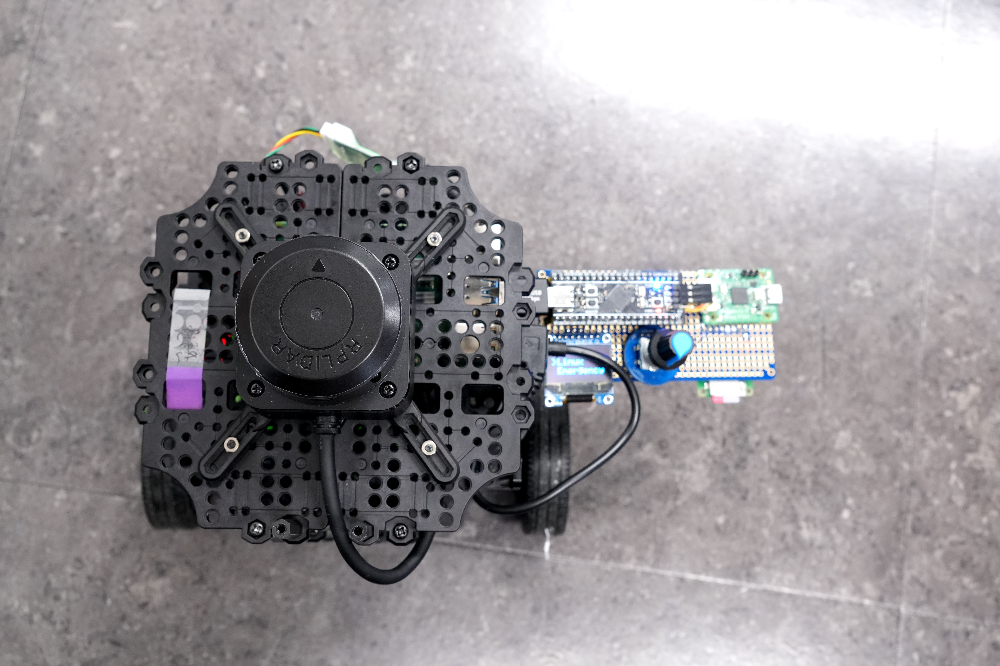
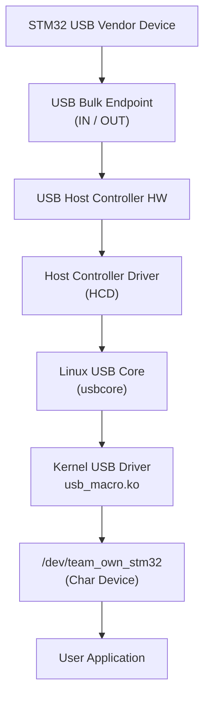
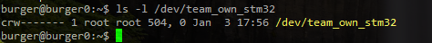
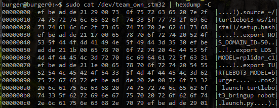

# USB Vendor Bulk Driver (Linux Kernel Module)

STM32 USB Vendor Class 장치와 Linux 시스템 간의 안정적인 데이터 통신을 위해  
USB Bulk 전송 기반의 Linux 커널 드라이버를 구현하였습니다.

본 드라이버는 USB 스트림 데이터를 프레임 단위로 재조립하여  
사용자 공간에서 `/dev/team_own_stm32` 캐릭터 디바이스를 통해  
read/write 인터페이스로 사용할 수 있도록 설계되었습니다.

---

## 1. 프로젝트 개요

USB Full-Speed 환경에서는 데이터가 64바이트 단위의 패킷으로 나뉘어 전송된다.
본 프로젝트에서는 커널 드라이버 단계에서 이러한 패킷을 하나의 프레임 단위로 재구성하여,
사용자 공간에서는 패킷 분할을 고려하지 않고 데이터를 처리할 수 있도록 설계하였다.

---

## 2. 개발 환경

- OS: Ubuntu 22.04 server 
- Kernel: 5.15.0-1092-raspi
- Device: STM32F411 (USB Vendor Class)
- Language: C (Linux Kernel)

---

## 3. 전체 시스템 구조




STM32는 USB Vendor Class 장치로 동작하며,  
Linux 커널 드라이버는 해당 장치를 인식하여  
캐릭터 디바이스(`/dev/team_own_stm32`)를 생성한다.

---

## 4. 커널 드라이버 설계
본 커널 드라이버(usb_macro.ko)는 STM32 USB Vendor 디바이스와 사용자 공간 사이의
데이터 경로를 제공하며, 다음 역할을 수행한다.
### 4.1 USB Device 매칭

- VID / PID 및 Interface Class(0xFF)를 기반으로 디바이스를 매칭
- `usb_driver`, `probe()`, `disconnect()` 구조 사용
- USB 디바이스가 연결되면 커널 드라이버가 매칭되어
다음과 같은 probe 로그가 출력된다.


### 4.2 USB Bulk 비동기 처리 (URB)
URB는 비동기 방식으로 동작하여,
USB 전송 지연이 사용자 공간 I/O를 블로킹하지 않도록 설계되었다.

- Bulk IN / OUT 엔드포인트 사용
- **URB(USB Request Block)** 기반 비동기 전송
- 수신 완료 시 completion callback에서 처리

### 4.3 Character Device 인터페이스 
드라이버는 사용자 공간에서 사용하기 쉽도록 `/dev/team_own_stm32` 캐릭터 디바이스를 제공한다.
사용자는 일반 파일 I/O와 동일하게 open/read/write/poll을 사용할 수 있다.

- open(): 디바이스 사용 카운트 증가(open_count) 및 private_data에 디바이스 컨텍스트 설정
- read(): kfifo에 누적된 스트림 데이터를 프레임 단위로 재조립하여 반환
- write(): user가 전달한 프레임을 Bulk OUT URB로 비동기 전송
- poll(): 읽을 데이터가 있는지(POLLIN) 또는 disconnect 상태(POLLHUP/POLLERR) 제공
- release(): open_count 감소 및 disconnect 정리 시점 동기화에 활용

### 4.4 동기화 방식 

- 본 드라이버는 URB callback(비동기 콜백/atomic 컨텍스트)과 사용자 공간 file operation 컨텍스트가 동시에 공유 데이터를 접근할 수 있으므로, 각 실행 컨텍스트의 특성에 맞는 동기화 기법을 사용하였다.
 


## 5. 데이터 통신 프로토콜 

### 5.1 프레임 구조
- 0x00 4 magic
- 0x04 1 info (bit-fields)
- 0x05 2 cmd_len
- 0x07 249 cmd_statement
- Total: 256 bytes 

## 6. 빌드 및 실행 방법 

### 6.1 커널 모듈 로드 / 언로드 
```bash
sudo insmod usb_macro.ko
# 모듈 제거 시 확장자(.ko) 없이 이름만 사용
sudo rmmod usb_macro
```

### 6.2 디바이스 확인 
```bash
ls -l /dev/team_own_stm32
```

### 6.3 테스트 방법  
```bash
# 사용자 공간에서 프레임 수신 확인
sudo cat /dev/team_own_stm32 | hexdump -C
# 커널 로그 확인 (probe, URB RX, disconnect 등)
dmesg | tail -20
```
- STM32에서 전송된 프레임이 커널 드라이버를 통해 사용자 공간으로 정상 전달된 결과



## 7. Troubleshooting 
### 7.1 class_create() 컴파일 에러

#### 문제

- 커널 빌드 시 class_create() 관련 컴파일 에러 발생.

#### 원인

- Linux 커널 버전에 따라 class_create() 함수 시그니처가 변경됨.

**구버전 커널**

```bash
class_create(THIS_MODULE, name);
```

**신버전 커널 (Linux 5.x 이상)**
```bash
class_create(name);
```

#### 해결 

- 사용 중인 Linux 5.15 커널에 맞게 호출 방식 수정.

### 7.2 장치가 Vendor Class로 인식되지만 read 동작 안 됨

#### 문제

- probe() 함수는 정상 호출

- URB RX 로그는 커널 로그(dmesg)에 출력됨

- 사용자 공간에서 read() 호출 시 데이터가 전달되지 않음 

#### 원인

- STM32와 커널 드라이버 간 magic number 불일치로 인해
프레임 파싱 단계에서 수신 데이터가 유효한 프레임으로 인식되지 않음.

#### 해결

- Host/Device 간 magic number 정의를 통합하여
프레임 파싱 단계에서 데이터가 정상 처리되도록 수정